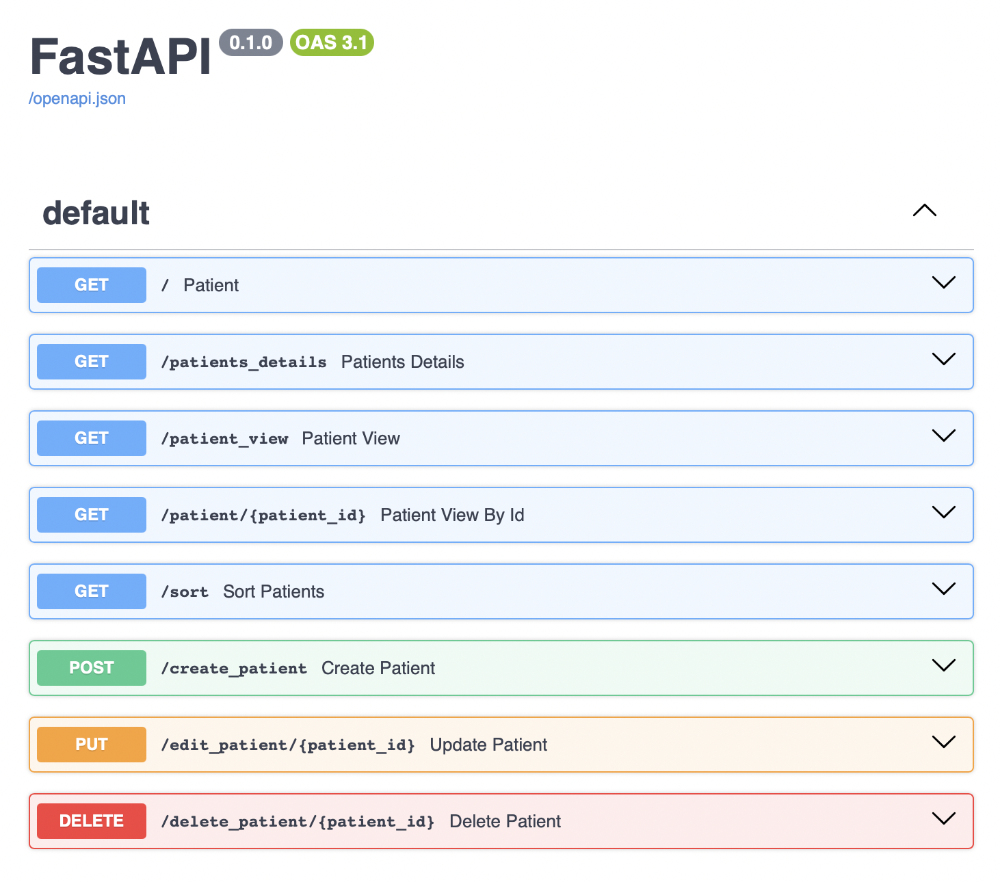

# fast-api

Fast api sever URL for this project - [patient-overview](http://127.0.0.1:8000/docs)

FastAPI is a modern, high performance web framework for building APIs with Python.

# Starlette

> A curated list of awesome projects, extensions, and resources for the Starlette ASGI framework/toolkit.

Starlette is a lightweight [ASGI](https://asgi.readthedocs.io/) framework/toolkit for Python, which is ideal for building high-performance asyncio services. It is production-ready and gives you tools for building APIs, WebSockets, GraphQL endpoints, and more. Many high-level frameworks (like FastAPI) are built on top of Starlette.

**Starlette:** [Docs](https://www.starlette.io/) | [Source](https://github.com/encode/starlette)

# Pydantic 

Pydantic is the most widely used data validation library for Python.

> A curated list of awesome things related to [Pydantic](https://pydantic-docs.helpmanual.io/).

These packages have not been vetted or approved by the pydantic team.

In the context of a web application or API built with FastAPI, 

"http server," "client," and "server" refer to distinct roles within the client-server architecture. A client initiates a request, a server receives and processes it, and FastAPI is the framework that handles the server-side logic. HTTPS, a secure version of HTTP, is often used, with a TLS Termination Proxy handling encryption/decryption. 

**HTTP Methods:**

GET, POST, PUT, DELETE

**HTTP status overview**

[http-status-codes](https://developer.mozilla.org/en-US/docs/Web/HTTP/Reference/Status)

**Elaboration:**

**Client:**
The client is the component that makes requests to the server. This could be a web browser, a mobile application, or any other program that needs to interact with the API. 

**Server:**
The server is the host that receives and processes requests from clients. It typically includes a web server (like Uvicorn) that listens for incoming requests and a FastAPI application that handles the logic. 

**HTTP Server:**
The term "http server" can refer to the actual software that runs on the server, such as Uvicorn. It handles incoming HTTP (or HTTPS) requests, forwards them to the FastAPI application, and returns responses back to the client.

**FastAPI:**
FastAPI is a Python framework that simplifies the development of web applications and APIs. It provides a set of tools and features for handling HTTP requests, data validation, and API documentation, according to FastAPI's documentation.

**HTTPS and TLS Termination Proxy:**
For secure communication (HTTPS), a TLS Termination Proxy is often used. This proxy handles the TLS handshake (establishing a secure connection), encrypting/decrypting the data, and then forwarding the decrypted HTTP data to the FastAPI application. 

**In essence:**

A client (e.g., web browser) sends a request to the server.
The http server (like Uvicorn) on the server receives the request.
FastAPI: processes the request and generates a response.
The http server sends the response back to the client.
If HTTPS is used, a TLS Termination Proxy handles the encryption and decryption.