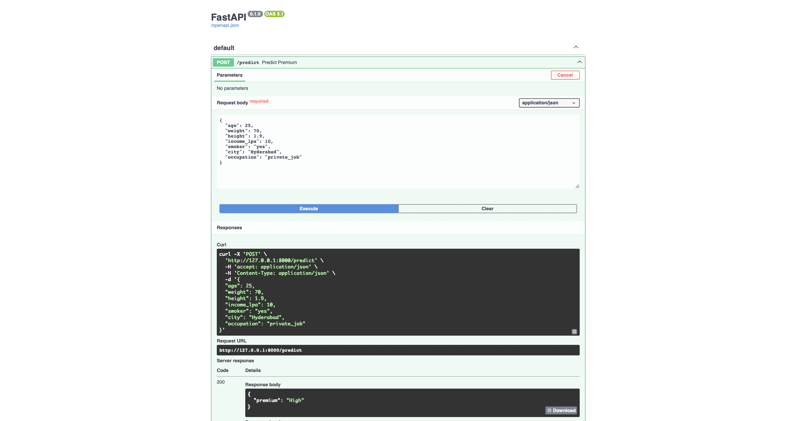
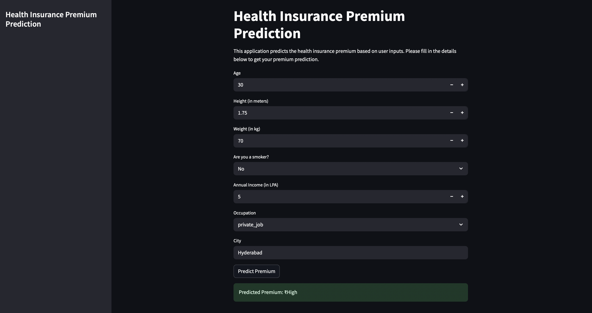

### Note: Make sure the FastAPI server is running and accessible at the specified API_URL.
# run - `uvicorn app:app --reload` in the terminal where `app.py` is located.
Go to `http://localhost:8000/docs`

## also run - `streamlit run frontend.py` in the terminal where `frontend.py` is located.
# streamlit run frontend.py

