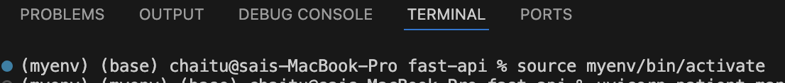

1. Install vscode
2. Create virtual envirnoment
    python -m venv {your env name}myvenv
3. Activate virtual environment
    mac- source myenv/bin/activate
    windows - myenv\Scripts\activate

4. Install dependencies
    pip install fastapi uvicorn pydantic

5. Start build your APIs/endpoints 🙈

6. Command to run - uvicorn {filename}hello_api:app --reload

